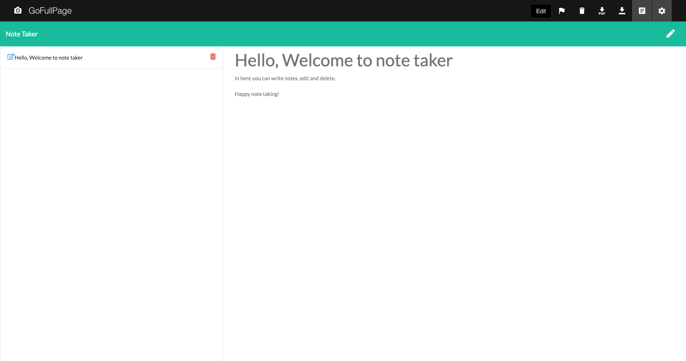
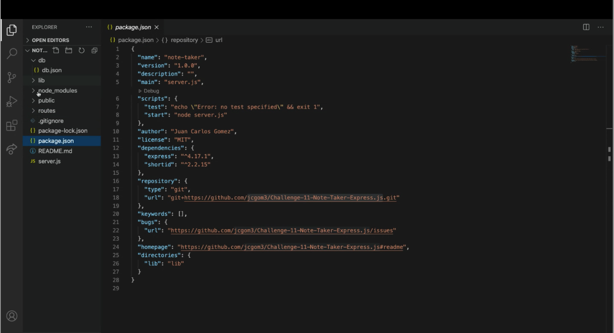

#Challenge-11-Note-Taker

## Description

## Tools Used
* HTML
* CSS
* JavaScript
* Node.js
* Express.js
* Heroku (https://dashboard.heroku.com/)

## Deployed Application

# Mockup Image

# Summary
Create a note taker generator using Javascript, Node.js & express.

# Description
This app allows users to input employee info for their team including: Manager, Engineer, and Intern
# Table of Contents 
* [Installation](#installation)
* [Usage](#usage)
* [License](#license)
* [Contributing](#contributing)
* [Tests](#tests)
* [Questions](#questions)
# Installation
The following necessary dependencies must be installed to run the application properly: npm, express & shortid
# Usage
In order to use this app, install the node dependencies and run the app in the terminal on VS Code use npm start or node server.js to start. App can also be used on Heroku. Click on the video for a demonstration. 
# Demo

# License

# Contributing
​Contributors: N/A
# Tests
N/A
# Questions
## Please contact me:
  * [My GitHub Profile](https://github.com/jcgom3)
  * [My Github Project Repository]( https://jcgom3.github.io/Challenge-11-Note-Taker-Express.js/)
  * Email me at: [Jcgom3@gmail.com](mailto:Jcgom3@gmail.com) with questions or make an issue about this project.